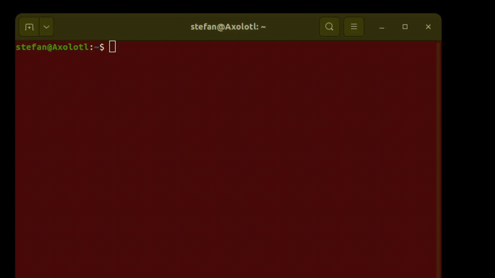
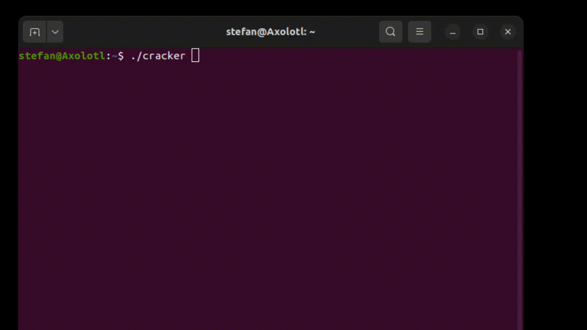

# TransposCipher

A simple transpositional cipher

## Demo of Runner




## Demo of Cracker




## Run Locally


Clone the project

```shell
  git clone https://github.com/Ctrl-AltElite/TransposCipher.git
```

Go to the project directory

```shell
  cd TransposCipher
```

Install dependencies (only instructions for linux)

```shell
  sudo-apt install gcc make
```

Compile

```shell
  make
```

Run Runner

```shell
  ./cipher
```

Run Cracker

```shell
  ./cracker
```


## Notes

Running the cipher runner with the -h argument will show you the possible alphabets to be used. By default the alphabet with id 2 is used. This includes all latin letters, lowercase and uppercase, without digits.
